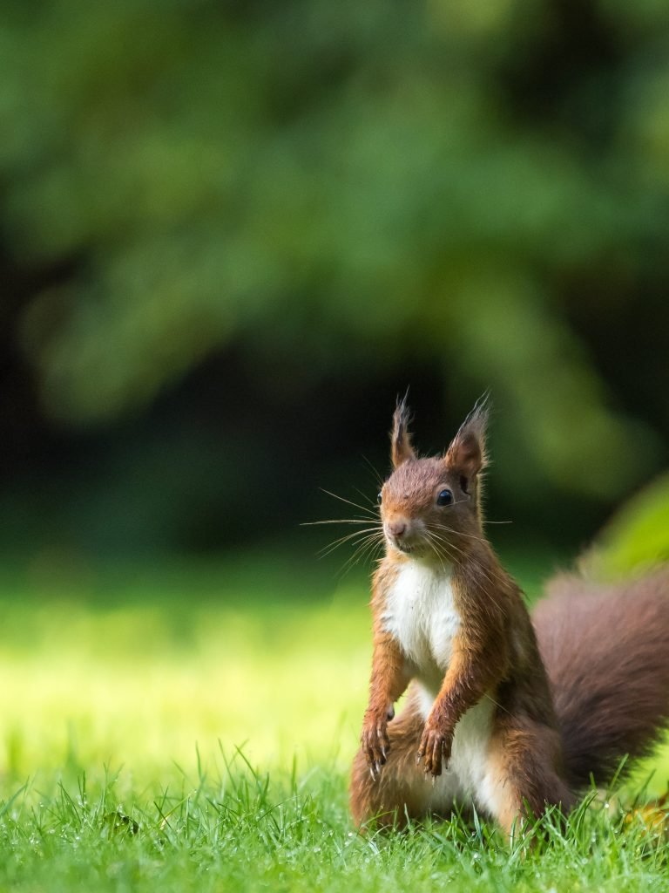

# Responsive images and SVG images

Learn how to do the following:

- Use the `<picture>` element to create a responsive image with art direction.
- Use an `` with `srcset` and `size` attributes to serve different image sizes for different screen widths.
- Load an SVG image with ``.
- Use inline SVGs and create a `<symbol>` to easily reuse your inline SVG.

## Continuity

Before starting this assignment, copy the HTML from your previous assignment into the main `index.html`, the `contact/index.html`, and the `about/index.html`. Also copy your favicons over.

## :art: Add a hero image using `<picture>`

A hero image is a large banner image that is displayed at the top of a webpage and is the first image visitors see. For examples, view Justinmind's' [post of 20 inspiring hero image websites](https://www.justinmind.com/blog/inspiring-hero-image-websites/) or search for examples on your own. Hero images should not include text. We will add text on top of our hero image in a later assignment after we learn CSS.

| :bulb: Hero videos                                                                                      |
| ------------------------------------------------------------------------------------------------------- |
| _Hero videos are becoming popular, and we will learn how to create a hero video later in the semester_. |

A `<picture>` element allows for _art direction_, or different versions of images cropped to display best on different screen sizes. Below is an example of images cropped to display on (from left to right) a laptop, a tablet, and a mobile phone.


For this assignment we will create three versions of images for laptops, tablets, and mobile devices. There are no "set" widths and heights to use, but for this assignment, assume

| Device | Max width | Suggested ratio |
| ------ | --------- | --------------- |
| laptop | `1920px`  | 16:9            |
| tablet | `768px`   | 4:3             |
| mobile | `380px`   | 1:1             |

The ratios are guides. You are welcome to use different ratios based on your own preferences. If you'd like a full screen hero image, don't try to force the sizing with HTML. After we learn CSS, you can use CSS to make the image fill the entire screen.

### Steps to create your hero `<picture>` element

1. Find a free high-resolution image for your hero image. You can search [Unsplash](https://unsplash.com/) or [Pexels](https://www.pexels.com/). If you use your own image, make sure the image is at least `1920px` wide.
2. Use a photo editor, such as [befunky](https://www.befunky.com/create/), to crop and resize your image to display on all three screen sizes. Make sure the cropping is obvious; don't just resize the image.
3. Save your images in the `images` folder. To make it easy for you to identify which image is which, append the width to the image file name. For example, in the images above, I used the file names
   - `hero-squirrel-1920w.jpg`
   - `hero-squirrel-768w.jpg`
   - `hero-squirrel-380w.jpg`
4. In your main `index.html` file, change the HTML to load your images (also delete the squirrel example images included in the repo). Here is the code included in the sample index.html:

   ```
   <picture>
    <source media="(min-width: 769px)" srcset="images/hero-squirrel-1920w.jpg">
    <source media="(min-width: 381px)" srcset="images/hero-squirrel-768w.jpg">
    <source media="(max-width: 380px)" srcset="images/hero-squirrel-380w.jpg">
    
   </picture>
   ```

   Make sure to include a fallback `` with descriptive alt text.

5. In order for the image to display properly, we need a little CSS. If this line is not already in your document `<head>` on all three of your html files, add this to your main `index.html` file:

   `<link rel="stylesheet" href="styles/main.css">`

   And add this to your subpages (notice the relative path to the styles folder):

   `<link rel="stylesheet" href="../styles/main.css">`

### Use Live Server and Dev Tools to make sure your images are loading properly

Before you open your webpage in Live Server, check the bottom left info bar on VS Code. You want to make sure you don't have any errors or warnings which should look like this:<br><br>
<br><br>
If you have errors or warnings, click on the icons to see what they are and fix them.

Once any problems are fixed, open Live Server and use the Dev Tools to make sure your images are loading properly.

| 🎥 WATCH: Dev Tools and `<picture>`                                                                                                                                                                                       |
| ------------------------------------------------------------------------------------------------------------------------------------------------------------------------------------------------------------------------- |
| Watch this [video on using Dev Tools with the `<picture>` element](https://youtu.be/2jkA83w1ibc) to learn how to use the Network tab in Dev Tools to check that your `<picture>` element images are downloading correctly |

## :art: On your About page, add an `` with `srcset` and `size` attributes to serve different image sizes for different screen widths.

TODO: instructions

## :chart: Add SVG images

### Add an SVG image to your contact page using ``

SVG images can be loaded on a web page just like PNG and JPG files.

1. Find a free SVG image on a site such as [Icon Finder](https://www.iconfinder.com/search?q=form&price=free) to add to your Contact `index.html`.
2. Make sure that the image has an `.svg` extension and save the SVG image file in your `images` folder.
3. On your contact page, add an `` element to load your SVG file. Use a relative path in the `src` attribute and don't forget to add an `alt` description.

### Add a simple inline SVG image to your main page using `<symbol>`

You can use the inline SVG you wrote for the inline SVG learning task. It can be as simple as a circle, although many students create a "hamburger" menu icon to use for our mobile menu assignment. The location of the SVG isn't important, just make sure it is easy for a TA to find.

Refer to the assigned reading [SVG intro](https://codepen.io/lsburton/pen/ZEBYbXw?editors=1100) for more information on inline SVG and `<symbol>`.

### Use Live Server to make sure your images are displaying properly

Before you open your webpage in Live Server, check the bottom left info bar on VS Code. You want to make sure you don't have any errors or warnings which should look like this:<br><br>
<br><br>
If you have errors or warnings, click on the icons to see what they are and fix them.

If everything looks good, then....

## :arrow_up: Use VS Code's Source Control (in the sidebar) to commit your changes and sync these changes to Github

## :rocket: Publish your site on Github pages

After you publish your site, wait a few minutes for it to generate. After it has generated, paste the link to your live site into your repo's about section. Also, feel free to change the `README.md` to add a description of your site. (You can access the original README.md in the repo's Feedback branch.)

## :no_entry_sign: Check that your site validates with no errors

Navigate to [Validator.nu](https://validator.nu/) and paste your Github Pages URL into the text field. Select "Show outline" and "Show image report." Click the "Check" button. If you have no errors or warnings, you're good to go!

## :speech_balloon: Leave a comment on the Feedback Pull-Request

On your Github repo, navigate to the Feedback pull requests. At the bottom of the page you will find a comment field. Leave a comment asking us to review your previous commit.
